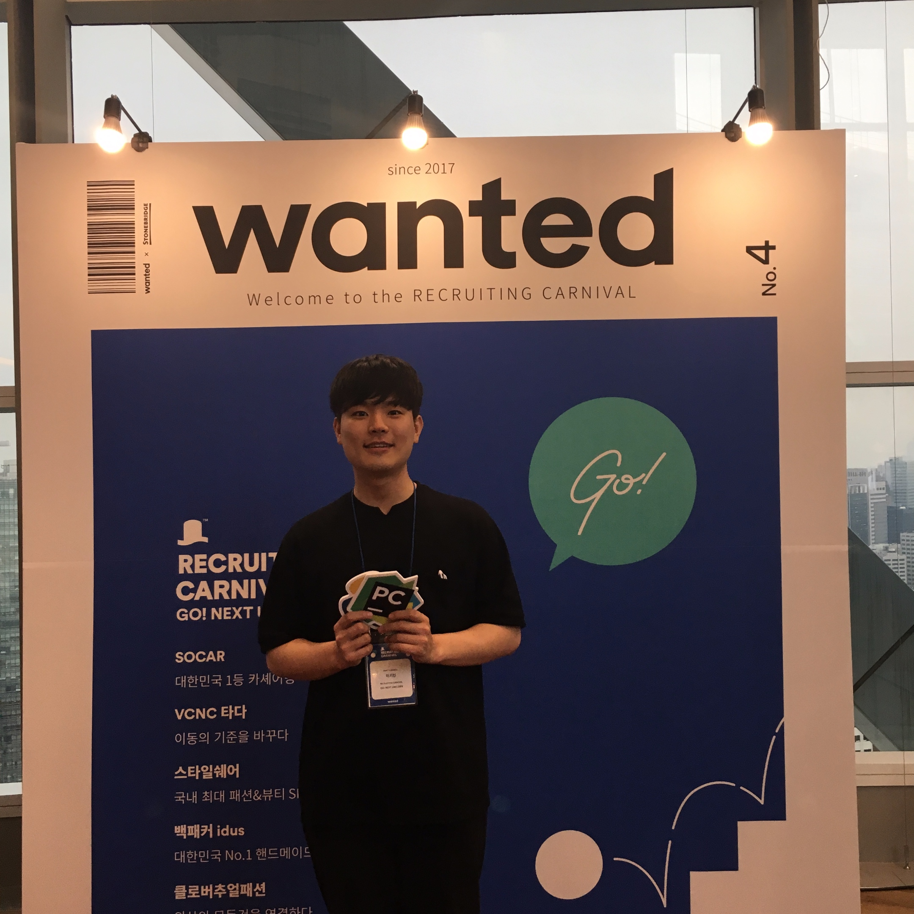

# About

"신입 개발자가 되고 싶은 신입 개발자 지망생"
{:.lead}

{:.lead srcset="/assets/img/blog/gin.jpg, /assets/img/blog/hydejack-8@0,5x.png 960w, /assets/img/blog/hydejack-8@0,25x.png 480w" data-width="1920" data-height="1080"}
머신러닝을 주로 공부하고 있습니다.
{:.figure}

## Project

### 1. 챗봇 프로젝트

### 프로젝트 기간 : 2019.09.09 ~ 2019.10.11

### 팀원 : 5명

### 맡은 역할

- 웹 부분 프론트엔드
- 챗봇 모델 (Seq2seq -> Seq2seq + Attention -> Transformer)

#### 모바일 버전도 고려

